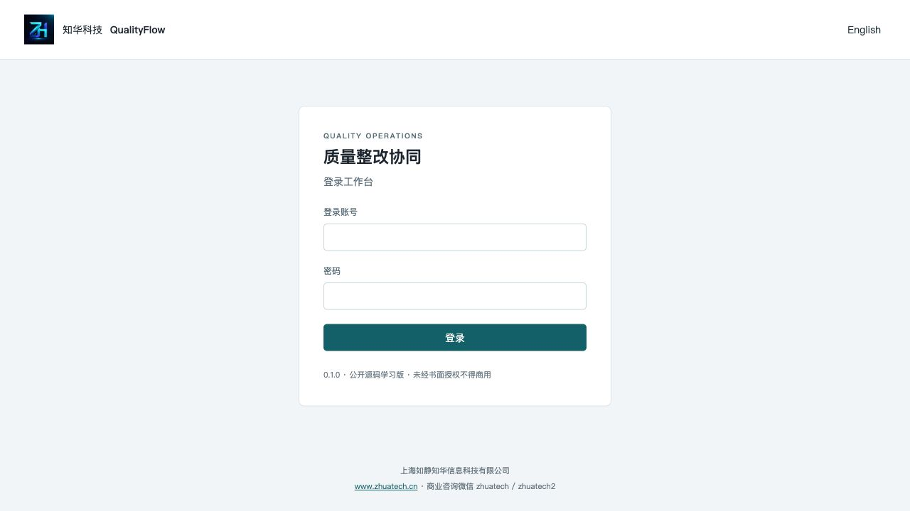
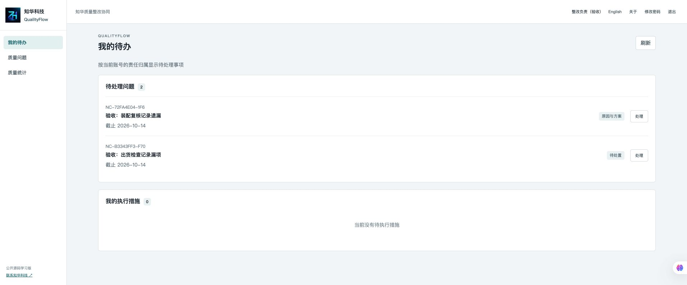
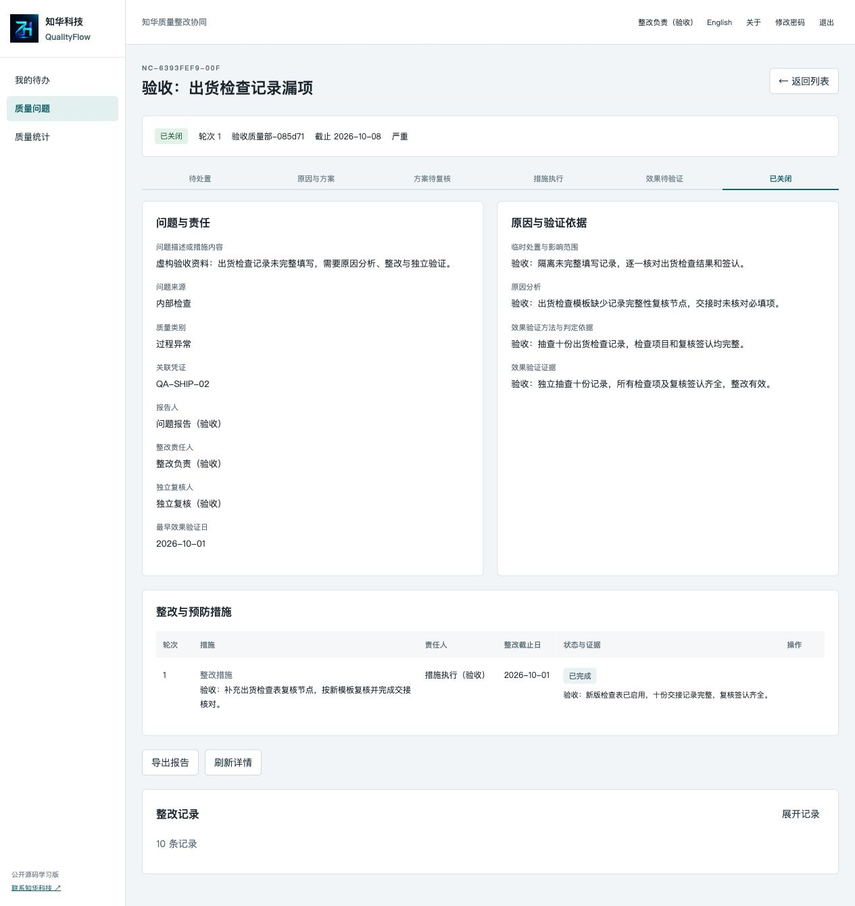
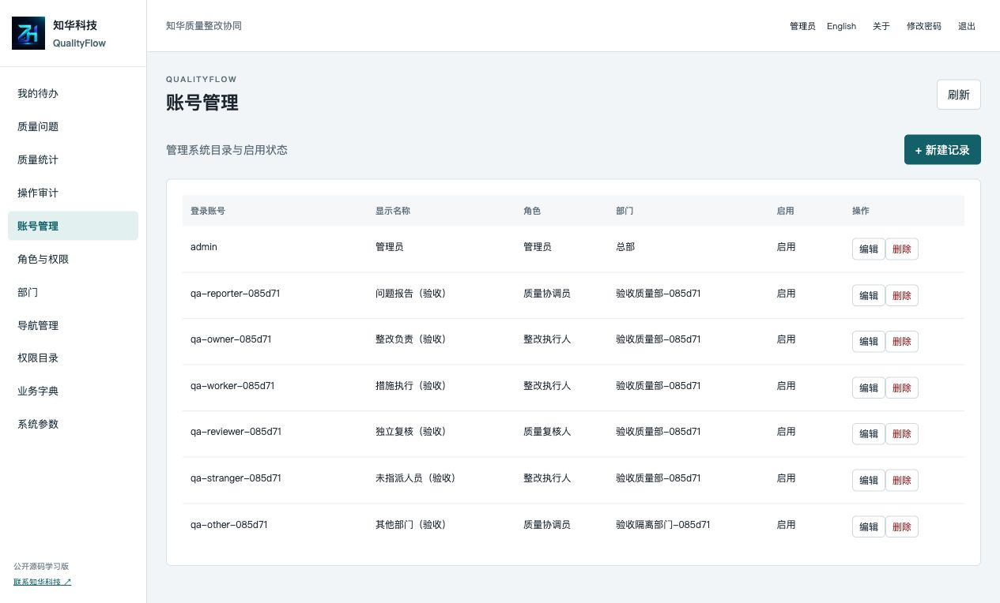
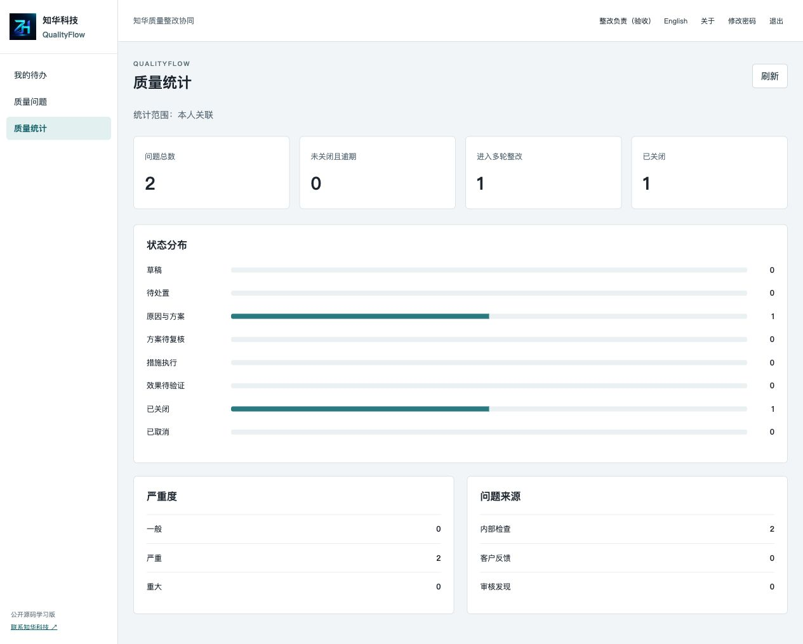
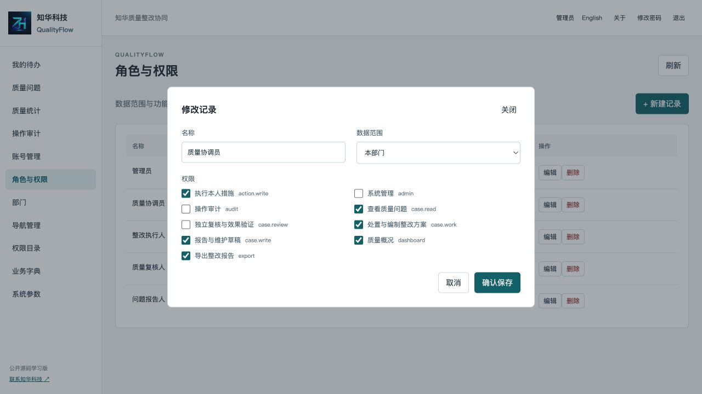

[中文](README.md) | [English](README.en.md)


# ZhiHua QualityFlow · Quality Nonconformance and Corrective Action Collaboration

**Public source learning edition 0.1.0 · Non-commercial use.**

ZhiHua Technology (Shanghai Rujing Zhihua Information Technology Co., Ltd.) · [Official website](https://www.zhuatech.cn/).

QualityFlow connects containment, cause analysis, corrective actions and independent effectiveness review after an internal inspection, customer complaint or audit finding. Quality leads, department coordinators and action owners can follow responsibilities and evidence through successive correction rounds. It supports learning enterprise quality workflows, access control and private deployment; it records human decisions and does not replace professional judgment or confer quality-system certification.

## Workflow, users and implemented features

```text
Draft → triage → investigation and plan → independent plan review
      → action execution → effectiveness review → closed
Returned plan → investigation
Ineffective verification or recurrence → new correction round with prior evidence retained
```

Submitted reports freeze their description and responsibility assignments. The owner records containment, analyzes causes and specifies actions and verification criteria. Assigned executors submit evidence; the designated independent reviewer verifies effectiveness and closes the case. Reopening retains prior actions and evidence.

| User | Implemented operations |
| --- | --- |
| Reporter/coordinator | Create, edit and delete own drafts; submit reports; cancel before containment; search titles/numbers, filter status, paginate and sort by creation, deadline or severity |
| Correction owner | Record containment, cause and verification plan; maintain unsent actions; change the deadline during investigation with a reason; submit plans and consolidate execution evidence |
| Action executor | View own tasks and complete assigned actions with evidence; cannot edit historical rounds |
| Independent reviewer | Approve or return plans, verify effectiveness and close, record failed verification or reopen a recurring issue |
| Administrator | Maintain users, roles, permission names, registered menus, departments, dictionaries and parameters; protect the last administrator and referenced records |
| Authorized readers | Download JSON reports, view own workbench, scoped statistics, department audit and account settings; Chinese/English UI |

The reviewer must differ from the reporter, correction owner and action executors across all rounds. Administrators cannot act for designated executors/reviewers. A plan requires causes, verification criteria and at least one action; all current-round actions must finish before verification is requested. The earliest verification date cannot precede the current-round action due dates. Reaching it never closes a case automatically: actual review evidence remains mandatory.

Case row locks, version checks and command idempotency prevent stale updates and duplicate actions. Business history and audit persist in the same transaction. `ALL`, `DEPARTMENT` and `ASSIGNED` scopes apply to lists, details, reports and statistics. Assigned scope includes own reports, ownership, review and current or historical action participation. Execution/review separately enforce designated responsibility.

### Limits

No instrument acquisition, sampling calculations, supplier portal, attachments, electronic signatures, notifications, inventory/orders, automatic ERP connector or AI judgment is implemented. Evidence is text and may reference controlled records; files are not uploaded. All implemented core workflows run locally without paid models or third-party business credentials. Frozen responsibility reassignment is not provided: retain the original record and create a related new report when appropriate.

This is a single-organization departmental system, without SaaS tenant isolation, persistent/distributed sessions, centralized rate limits or high availability. Database events are traceable records without tamper-proof electronic evidence. Performance testing, penetration testing, real instrument integration, electronic certification and production multi-instance recovery require separate assessment.

## Actual running pages

These images show version 0.1.0 running with clearly fictional records in an independent acceptance database. Such business records are not included in empty-database initialization. Login authenticates roles, the workbench lists own responsibilities/actions, detail retains the case and history, accounts assign roles/departments, statistics aggregate authorized data and permissions maintain access scope.

| Page | Screenshot |
| --- | --- |
| Login |  |
| User workbench |  |
| Case and corrective actions |  |
| Account management |  |
| Quality statistics |  |
| Roles and access scopes |  |

See the [operation manual](docs/操作手册.md) for workflows, review rules and error handling.

## Architecture, requirements and layout

Browser → same-origin Nginx → Spring Boot → MySQL, with server-side authorization, JPA transactions, Flyway migrations and a persistent database volume.

| Layer | Runtime |
| --- | --- |
| Backend | Java 21, Maven 3.9, Spring Boot 4.0.7, Spring Security, JPA and Flyway |
| Frontend | Vue 3.5.40, Vite 8.1.5, JavaScript, Node 24.19.0 or later |
| Database | MySQL 8.4, MariaDB Connector/J 3.5.10; H2 is only for automated integration tests |
| Local deployment | Docker Engine/Desktop, Compose v2, Nginx 1.29; access to official dependency registries |
| Configuration/acceptance | Python 3.10 or later |

```text
backend/src/main/java/cn/zhuatech/qualityflow/  Identity, quality workflow and administration
backend/src/main/resources/db/migration/      V1 schema, V2 indexes/navigation, V3 complete event text
backend/src/test/                             Unit and HTTP integration tests
frontend/src/                                Workbench, cases, statistics, management and forms
frontend/public/brand/                        Official logo
scripts/                                     Private configuration, real-database acceptance, release checks
docs/                                        Operations, architecture, deployment, tests, third-party notices and screenshots
compose.yaml                                 Local learning environment
```

`quality_case` stores the current case/round, `corrective_action` all rounds of actions, `case_event` append-only business history and `mutation_stamp` command retries. Identity, roles, menus, dictionaries, parameters and audit use separate tables. Foreign keys protect references; indexes cover department, status, owners, timestamps and rounds.

## Installation, initialization and configuration

```sh
git clone https://github.com/zhuatech-han/zhuatech-qualityflow.git
cd zhuatech-qualityflow
python3 scripts/init-env.py
docker compose config --quiet
docker compose up -d --build --wait
```

Open [http://127.0.0.1:8098](http://127.0.0.1:8098), with [health](http://127.0.0.1:8098/actuator/health). The initial account is `admin`; read its generated `ADMIN_PASSWORD` privately from `.env`. There is no universal demonstration password. The script creates three independent strong passwords, file mode 0600, and refuses to overwrite existing `.env`. Never commit credentials. Bootstrap only initializes an empty database, and restarting or changing environment values does not reset existing accounts.

Empty initialization creates headquarters, five roles, nine permissions, eleven navigation entries, source/category dictionaries, time zone, system name and one administrator. It does not create quality cases. Create separate coordination, execution and review accounts, and keep an enabled administrator with full scope. Disposable local acceptance scripts can create explicitly fictional records.

| Variable | Purpose |
| --- | --- |
| `DATABASE_PASSWORD` | Required application database password |
| `MYSQL_ROOT_PASSWORD` | Required MySQL maintenance password |
| `ADMIN_PASSWORD` | Required initial empty-database administrator password; new/reset passwords must be 12–72 characters with uppercase, lowercase and digits |
| `WEB_PORT` / `BIND_ADDRESS` | Defaults 8098 / 127.0.0.1; use a free port without stopping other projects |
| `COOKIE_SECURE` | False for local HTTP; true for correctly configured HTTPS |
| `DATABASE_URL`, `DATABASE_USER`, `DATABASE_CATALOG` | Direct backend startup database URL/user/catalog; the catalog must match the database name |

Names are documented in [.env.example](.env.example). Compose fixes its database/user to `zhuatech_qualityflow` / `qualityflow`; it does not expose database or backend host ports. Private passwords are injected through environment values, never database URLs.

For source development, create an independent MySQL 8.4 database and least-privileged application account, configure the database variables above plus a strong administrator password, and run:

```sh
cd backend
mvn spotless:check test spring-boot:run
# In a separate terminal under frontend:
npm ci
npm run dev
```

Vite listens on local 5173 and proxies to backend 8080. Override with `npm run dev -- --port 5178` if needed. Container Nginx uses the backend service name.

## Database migration, deployment and recovery

Flyway executes `V1__quality.sql`, `V2__quality_indexes.sql` and `V3__event_text.sql` in order. V1 creates identity/business structures, V2 adds indexes and navigation permission constraints, and V3 preserves complete long-text event evidence. JPA validates mappings without creating or altering tables. Existing executed migrations must not change; add increasing `V<number>__description.sql` migrations.

Before upgrades pause writes, back up the database and private `.env`, inspect new migrations, build and start the intended version, then verify migration, health, login and workflow. On failure inspect logs and restore the matching database backup and application version; do not delete Flyway history or real data volumes. The existing acceptance record documents fresh V1–V3 and business-data V2→V3 migration; it does not promise arbitrary earlier-version compatibility. See [deployment and upgrades](docs/部署与升级.md) and [architecture/API](docs/架构与接口.md).

```sh
docker compose exec -T mysql sh -c 'MYSQL_PWD="$MYSQL_ROOT_PASSWORD" mysqldump -uroot --single-transaction zhuatech_qualityflow' > qualityflow-backup.sql
docker compose down
```

Keep backups private; exercise restoration into a separate empty database and compare original accounts, all rounds, actions, evidence and reports. `down` preserves the database; `down -v` is only for a named disposable test environment.

Written authorization is required for commercial deployment. Configure trusted HTTPS, secure cookies, trusted reverse-proxy handling, database isolation/least privilege, certificate validation, backups, audit protection and separate security/capacity review. Local MySQL uses TLS `sslMode=trust`, without CA/hostname validation; configure trusted CA and `verify-full` appropriately for deployment. The non-root Java 21 runtime includes Maven/build tools and is larger than a dedicated JRE. Frontend Nginx also runs non-root.

## Tests and isolated acceptance

```sh
cd backend
mvn spotless:check test package
cd ../frontend
npm ci
npm run format:check
npm run lint
npm test
npm run build
cd ..
docker compose config --quiet
docker compose build
# Only an independent, fresh, disposable local database:
docker compose -p qualityflow-check up -d --build --wait
python3 scripts/smoke.py --allow-test-data
python3 scripts/release-check.py
git diff --check
# After checks, remove only this disposable acceptance deployment:
docker compose -p qualityflow-check down -v
```

Use `--base http://127.0.0.1:<port>` with the matching test port when necessary. The script creates fictional accounts and records; it does not clean existing business data. Browser test credentials must remain in a restricted file outside the repository and be removed afterward.

Tests cover dates/states/versions, complete correction closure, observation dates, independent reviewers, cross-department/assigned isolation, draft/action editing, repeated/concurrent commands, CSRF, password revocation and last-administrator protection. H2 HTTP/migration integration does not replace fresh MySQL acceptance. Docker Maven builds run tests with dependency-cache locks and retries. See [test and acceptance records](docs/测试与验收.md); earlier page counts describe that recorded acceptance, not a production certification.

## Security, troubleshooting and contribution

Sessions use HttpOnly/SameSite=Strict cookies and CSRF. Passwords use BCrypt cost 12. Eight failed login attempts restrict the IP/account for five minutes; the window is process-local. Account disabling, password changes and role changes are checked on subsequent requests; passwords/hashes are not returned and authentication payloads are not logged.

| Issue | Check |
| --- | --- |
| Compose configuration rejected | Three required passwords and valid free port |
| Unhealthy MySQL | Disk, initialization logs and original volume credentials; new environment values do not reset them |
| Unhealthy backend | Database name/password, Flyway and JPA validation |
| Login failed | Initial private password or current account status; do not guess a shared password |
| Browser request failed | Nginx routing, backend health, HTTPS and cookie configuration |
| `STALE_VERSION` | Refresh details; retry an unchanged command with its original key/content |
| Closure rejected | Completed current-round actions, earliest verification date, independent reviewer and actual evidence |

Issue reports should include version, redacted reproduction and expected result. Contributions need clear data/permission boundaries and passing format, tests and deployment checks. Never upload customer records, passwords, sessions, certificates or unredacted logs. Report vulnerabilities privately using the contacts below.

## License and contact

The project's own code uses the existing [ZhuaTech Non-Commercial Source License 1.0](LICENSE), for individual learning, technical research and non-commercial exchange. Written authorization from Shanghai Rujing Zhihua Information Technology Co., Ltd. is required for commercial delivery, paid deployment, SaaS operation, resale, paid services, enterprise deployment and commercial modifications. This is publicly available non-commercial source, not an OSI open-source license or an MIT/Apache commercial-use grant for the project's own code. [Third-party notices](docs/第三方说明.md) preserve their respective rights. Software is supplied as-is; users remain responsible for quality judgments, backups, security and applicable requirements.

**ZhiHua Technology (Shanghai Rujing Zhihua Information Technology Co., Ltd.)**. For commercial authorization, customization, deployment and system integration:

- Website: [https://www.zhuatech.cn/](https://www.zhuatech.cn/)
- Email: [han@zhuatech.cn](mailto:han@zhuatech.cn)
- Email: [jack@zhuatech.cn](mailto:jack@zhuatech.cn)
- WhatsApp: [+86 17521234993](https://wa.me/8617521234993)
