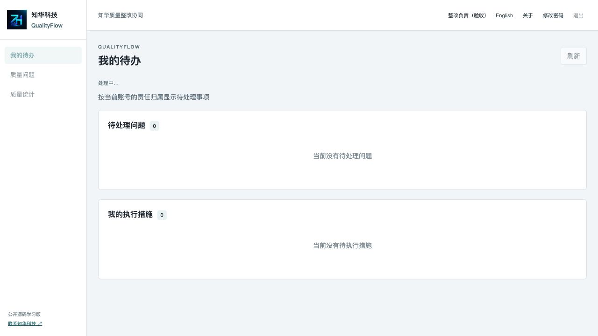

# 知华科技 · QualityFlow 质量整改协同

**公开源码学习版 0.1.0** · 上海如静知华信息科技有限公司 · [知华科技官网](https://www.zhuatech.cn/)

发现质量问题之后，谁先控制影响、谁查明原因、谁执行措施、谁确认整改有效？QualityFlow 为内部检查、客户反馈和审核发现提供一条可追踪的整改路径。它面向质量负责人、部门协调员和整改执行人员，适合学习企业质量流程、权限控制与私有化部署。

报告提交后，问题描述与责任归属冻结。整改责任人先登记临时处置，再编制原因分析、措施及效果验证依据。措施责任人提交执行证据，指定的独立复核人验证效果后关闭问题；验证无效或问题复发时开启下一轮，并保留之前的措施与证据。系统记录人工判断，不替代质量专业判断，也不代表取得任何体系认证。

## 先看工作流程

```text
报告草稿 → 待处置 → 原因与方案 → 方案待复核 → 措施执行 → 效果待验证 → 已关闭
                          ↑         │                          │        │
                          └─退回方案┘                          │        │
                          └────────────验证无效：新一轮整改─────┘        │
                          └────────────问题复发：新一轮整改─────────────┘
```

- 复核人须与报告人、整改责任人和措施执行人独立。管理员也不能代替指定人员执行或复核。
- 没有原因、验证依据或措施的方案不能送审；未完成全部本轮措施时不能提交效果验证。
- 最早效果验证日不得早于本轮措施截止日。到达该日期后，复核人仍须填写实际验证证据。
- 写入使用问题行锁、版本校验和命令幂等键，防止旧页面覆盖及重复提交。业务事件与操作审计同事务保存。

## 能做什么

| 使用者 | 已实现能力 |
| --- | --- |
| 问题报告人、协调员 | 报告草稿增删改查、提交、处置前取消；标题或编号搜索、状态筛选、分页及按时间、截止日或严重度排序 |
| 整改责任人 | 临时处置、原因分析、验证计划、未送审措施增删改、调查阶段调整截止日并留理由、送审和汇总执行证据 |
| 措施责任人 | 本人措施待办、执行证据提交；历史轮次不可修改 |
| 独立复核人 | 方案通过或退回、效果验证关闭、无效验证与复发重新开启 |
| 管理员 | 用户、角色、权限名称、已登记菜单、部门、字典和系统参数维护；最后管理员和业务引用保护 |
| 获授权人员 | JSON 整改报告、本人工作台、按数据范围统计、部门操作审计、个人修改密码、中英文界面 |

功能权限与数据范围分别控制。`ALL` 可读取全部问题；`DEPARTMENT` 可读取本部门问题；`ASSIGNED` 只读取本人报告、负责、复核或执行措施的关联问题。列表、详情、报告和统计采用相同范围。执行与复核还校验指定责任人。

首版不包含检验仪器采集、抽样计算、供应商门户、附件上传、电子签名、消息推送、库存与订单操作、ERP 自动对接或 AI 判断。所有已实现流程在本地运行，无付费模型或第三方业务服务凭证要求。凭证与证据目前为文本，可登记受控资料编号；不会上传文件。

## 实际运行页面

以下截图使用独立验收库中的虚构资料，页面与 0.1.0 源码对应。

| 页面 | 预览 |
| --- | --- |
| 登录 |  |
| 用户端首页：我的待办 |  |
| 核心业务：质量问题与措施 |  |
| 后台：账号管理 |  |
| 质量统计 |  |
| 角色与数据权限 |  |

操作界面保持简洁。完整步骤、异常提示及复核规则见[操作手册](docs/操作手册.md)。

## 启动一个独立学习环境

需要 Docker Engine / Docker Desktop 与 Compose v2，或本地 Java 21、Maven 3.9、Node.js 24.19.0 及 MySQL 8.4。凭证生成脚本需要 Python 3.10 或更高版本。

```sh
python3 scripts/init-env.py
docker compose up -d --build --wait
```

打开 `http://127.0.0.1:8098`。管理员登录账号为 `admin`，密码是本地 `.env` 中生成的 `ADMIN_PASSWORD`，没有通用演示密码。该文件权限为 `0600` 且不进入 Git。初始化 BCrypt 散列与此密码对应；首次启动后重启不会覆盖账号。脚本拒绝覆盖已存在的 `.env`。

端口被占用时修改 `.env` 的 `WEB_PORT`，再启动本项目。MySQL 和后端不映射主机端口，不需要停止其他项目。健康检查：`http://127.0.0.1:8098/actuator/health`。

| 配置 | 用途 |
| --- | --- |
| `DATABASE_PASSWORD` | 应用数据库账号密码，必填 |
| `MYSQL_ROOT_PASSWORD` | MySQL 初始化管理密码，必填 |
| `ADMIN_PASSWORD` | 空库管理员密码，必填；已有库不会重复初始化 |
| `WEB_PORT` | 前端主机端口，默认 `8098` |
| `BIND_ADDRESS` | 默认 `127.0.0.1`，本机访问 |
| `COOKIE_SECURE` | 本地 HTTP 为 `false`；正式 HTTPS 环境启用 `true` |

字段示例见 [.env.example](.env.example)。自运行后端还可配置 `DATABASE_URL`、`DATABASE_USER`、`DATABASE_CATALOG`，后者必须与实际数据库名一致。数据库真实密码只通过 `DATABASE_PASSWORD` 注入。

### 本地开发

先建立独立 MySQL 8.4 数据库 `zhuatech_qualityflow` 与应用账号，授予该库必需权限。将数据库地址、数据库名、账号和密码设置为上述环境变量，并设置独立强 `ADMIN_PASSWORD`。

```sh
cd backend
mvn spotless:apply
mvn spotless:check test spring-boot:run
```

另一个终端运行：

```sh
cd frontend
npm ci
npm run dev
```

Vite 默认监听本机 `5173`，通过代理连接本机后端 `8080`；可用 `npm run dev -- --port 5178` 覆盖开发端口。容器前端使用 Nginx 服务名代理，不写死本机后端地址。

## 数据、迁移与架构

后端为 **Java 21 / Spring Boot 4.0.7 / Spring Security / JPA**，前端为 **Vue 3.5.40 / Vite 8.1.5 / JavaScript**，数据库为 **MySQL 8.4**，结构升级由 **Flyway** 管理。使用 MariaDB Connector/J 3.5.10 连接 MySQL；运行数据和全新库验收均使用 MySQL，H2 仅用于自动化集成测试。

```text
浏览器 → Nginx → Spring Boot → MySQL
              同源会话       Flyway + 数据卷
```

```text
backend/src/main/java/cn/zhuatech/qualityflow/    权限、认证、质量业务与管理服务
backend/src/main/resources/db/migration/        V1 建表、V2 索引与导航约束、V3 完整文本历史
backend/src/test/                               单元与 HTTP 集成测试
frontend/src/                                  待办、问题、统计、管理与表单
scripts/                                       独立配置生成、实库验收、发布检查
docs/                                          操作、架构、部署、安全、验收与第三方说明
```

`quality_case` 保存问题与当前轮次，`corrective_action` 保存每轮措施，`case_event` 保存追加式业务历史，`mutation_stamp` 保存命令重试凭据；账号、角色、菜单、字典、参数和审计独立建表。外键保护被引用记录，索引覆盖部门、状态、责任人、时间与措施轮次。

空库先执行版本化结构迁移，再初始化总部、五类角色、九项权限、十一项菜单、来源与类别字典、时区和系统名称，以及一个管理员。不注入虚构业务。需演示时可在**可销毁的本机验收部署**中运行下面的实库脚本；它会建立明确标记的虚构验收资料。

升级前备份数据库和 `.env`。新增迁移按 `V数字__说明.sql` 命名，已发布迁移不修改。启动时 Flyway 校验和升级，JPA 验证实体结构。升级、备份、TLS 与故障处理详见[部署与升级](docs/部署与升级.md)，接口与数据库关系见[架构与接口](docs/架构与接口.md)。

## 验证与安全边界

```sh
cd backend
mvn spotless:check test package
cd ../frontend
npm ci
npm run format:check
npm run lint
npm test
npm run build
cd ..
docker compose config --quiet
docker compose build
python3 scripts/smoke.py --allow-test-data
python3 scripts/release-check.py
git diff --check
```

自动化测试覆盖日期、状态、旧版本、完整闭环、观察日、独立复核、跨部门与指派隔离、草稿与措施维护、重复与并发提交、CSRF、密码撤销和管理员保护。完整实库和页面验收记录见[测试与验收](docs/测试与验收.md)。镜像中的 Maven 构建执行测试，使用依赖缓存锁、预取及重试。

- 会话 Cookie 为 HttpOnly / SameSite Strict，写接口默认开启 CSRF；密码使用 BCrypt 12 轮，8 次失败后限制同 IP 与账号五分钟。
- 密码修改、禁用账号和角色变更会在后续请求重新核验。密码与散列不返回，日志不记录认证载荷。
- 本地 MySQL TLS 默认 `sslMode=trust`，连接加密但不校验证书链。正式部署必须使用可信 CA、主机名校验及合适的 `verify-full` 配置，HTTPS 入口启用 Secure Cookie。
- 本版为单组织、部门隔离结构，未提供 SaaS 租户隔离、集中限流或持久化会话。业务事件可追踪，但不是防篡改电子存证。
- Docker 运行镜像使用 Maven / Java 21 官方基础镜像和非 root 账号；镜像包含构建工具，体积较大。前端为非 root Nginx。

无法启动时先查看 `docker compose ps` 和对应服务日志；健康失败通常与必填配置、数据库名或迁移不一致有关。`STALE_VERSION` 表示详情过期，应刷新再操作；无法关闭先核对措施完成状态和最早验证日。不要修改已发布迁移消除校验错误，不要通过删除数据卷处理真实业务问题。

## 贡献、反馈与授权

提交问题时附版本、可脱敏复现步骤及预期结果。贡献需说明数据和权限边界，并通过现有格式、测试和部署检查；不要上传客户资料、密码、会话、证书或未脱敏日志。安全漏洞请通过下方咨询微信私下反馈，公开 Issue 不应包含可利用细节或敏感材料。第三方版权与协议见[第三方说明](docs/第三方说明.md)。

自有源码遵循根目录 [LICENSE](LICENSE)：仅限自然人个人学习、技术研究与非商业交流，未经书面授权不得商用。企业内部生产、商业交付、收费部署、SaaS、转售及商用二次开发需取得书面授权。该许可证不是 OSI 标准开源许可证；第三方组件保留各自许可。软件按现状提供，使用者负责核对质量结论、数据备份、部署安全及适用规则。

## 联系知华科技

本项目由知华科技（上海如静知华信息科技有限公司）提供公开源码学习版本，主要用于个人学习、技术研究与非商业交流。未经书面授权不得商用。企业信息化建设、中小企业数字化转型、中小企业 AI 转型、私有化部署、软件外包、软件项目外包、软件实施、FDE 外包、OPC 技术支持及深度定制开发，请访问知华科技官网 https://www.zhuatech.cn/，或添加微信 zhuatech、zhuatech2 咨询。

- 官网：[www.zhuatech.cn](https://www.zhuatech.cn/)
- 商业授权、定制开发、部署与系统集成咨询微信：`zhuatech`、`zhuatech2`

| 微信 zhuatech | 微信 zhuatech2 |
| :---: | :---: |
|  |  |
